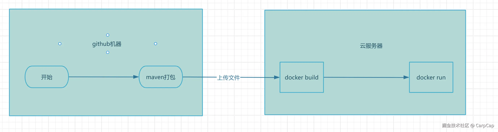
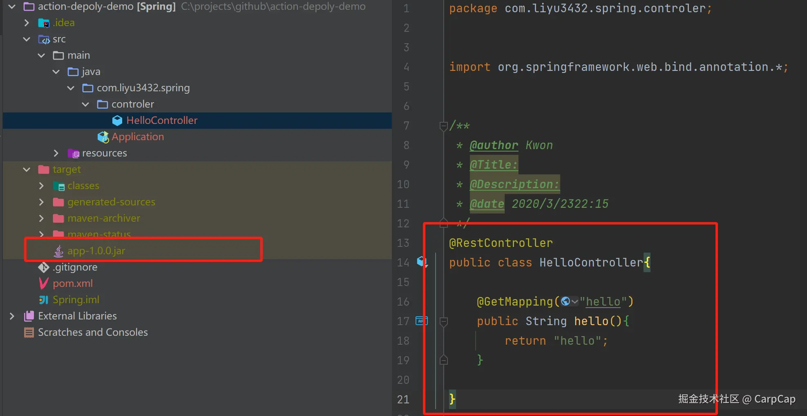
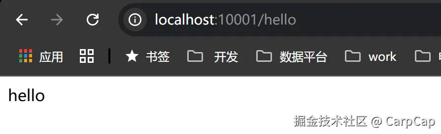
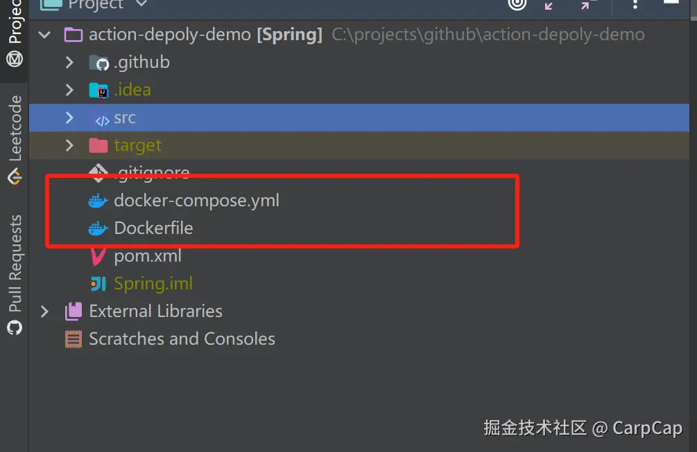
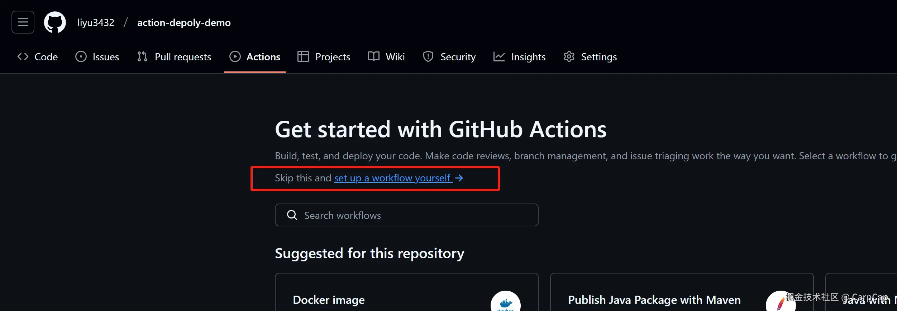
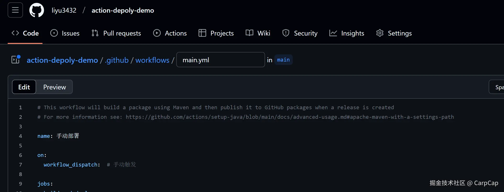
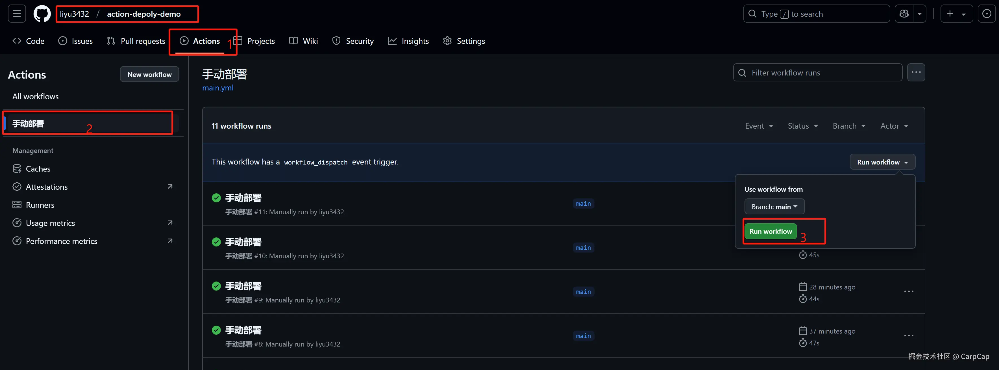
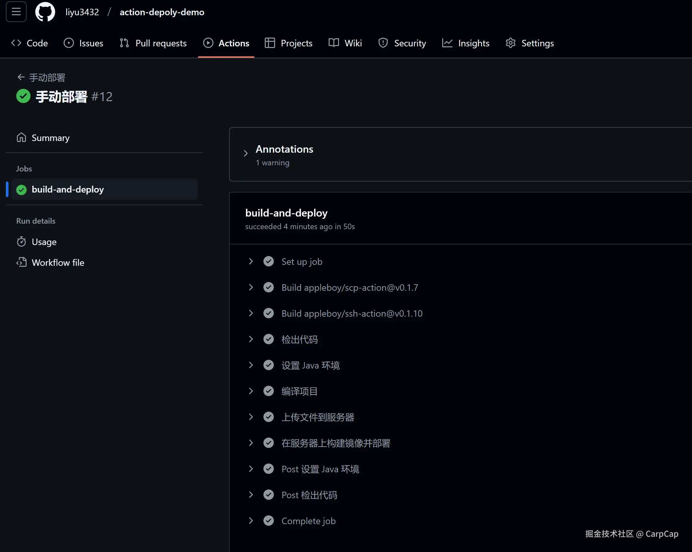

使用Github自带的功能快速的把Java项目部署到云服务器，你能从中获取到关于Github自动化部署的知识以及整个部署流程

## 项目地址

*   [action文件路径](https://github.com/liyu3432/action-depoly-demo/blob/main/.github/workflows/main.yml)
*   [文章地址](https://juejin.cn/post/7458303492210393139)


## 阅读前提

本文假设读者具备以下基础知识：

1.  CI/CD
2.  Docker 和 Docker compose
3.  Maven
4.  Java

所需要的环境

1.  云服务器 或者 公网能访问到的机器
2.  云服务器需要有docker、docker compose
3.  jdk8
4.  代码在github上存储

## Github aciton 流程

1.  github提供的机器负责对java代码进行编译生成jar包
2.  通过scp 将jar包、Dockerfile、docker-compose.yml文件上传到云服务器
3.  通过ssh 让云服务器构建镜像、以及docker compose 运行容器




## Java项目

### 1. 先随便搞一个项目确定能打包和访问就行（最上面有demo项目）

```shell
# 打包命令
mvn clean package 
```

图下打包后的文件是app-1.0.0.jar，可以通过 java -jar 命令先在本地确保jar包可以执行


图中端口是10001，后续改成了9014

### 2. 添加docker相关文件


可以修改的内容，如：

*   包名称  ： app-1.0.0.jar
*   镜像名称： myapp:latest
*   容器名称： myapp
*   JVM参数：  JVM\_OPTS: "-Xmx256m -Xms32m "

Dockerfile

```
FROM openjdk:8-jre
MAINTAINER CarpCap
RUN ln -sf /usr/share/zoneinfo/Asia/Shanghai /etc/localtime
ADD target/app-1.0.0.jar /app.jar
EXPOSE 9014
ENTRYPOINT ["sh","-c","java  -jar $JAVA_OPTS  /app.jar"]


```

docker-compose.yml

    version: '3'
    services:
      app:
        build:
          context: .
          dockerfile: Dockerfile
        image: myapp:latest # 镜像名称
        environment:
          JAVA_OPTS: "-Xmx256m -Xms32m "
        restart: always  # 总是重启
        container_name: myapp #容器名称
        ports:    # 指定端口映射
          - "9014:9014"

## Github Action

### 1.创建一个新的action文件



### 2.放入内容



main.yml

    # This workflow will build a package using Maven and then publish it to GitHub packages when a release is created
    # For more information see: https://github.com/actions/setup-java/blob/main/docs/advanced-usage.md#apache-maven-with-a-settings-path

    name: 手动部署

    on: 
      workflow_dispatch:  # 手动触发

    jobs:
      build-and-deploy:
        runs-on: ubuntu-latest
        steps:
          # 1. 检出代码
          - name: 检出代码
            uses: actions/checkout@v3

          # 2. 设置 Java 环境
          - name: 设置 Java 环境
            uses: actions/setup-java@v3
            with:
              java-version: '8'  # 根据你的项目选择 Java 版本
              distribution: 'temurin'
          # 3. 编译项目
          - name: 编译项目
            run: mvn clean package

          # 4. 上传文件到服务器
          - name: 上传文件到服务器
            uses: appleboy/scp-action@v0.1.7
            with:
              host: ${{ secrets.SERVER_HOST }}     # 引用 GitHub Secrets 中的服务器 IP
              username: ${{ secrets.SERVER_USER }} # 引用 GitHub Secrets 中的用户名
              password: ${{ secrets.SERVER_PASS }} # 引用 GitHub Secrets 中的密码
              source: "./docker-compose.yml,./Dockerfile,./target/*.jar"
              target: /usr/local/apps/myApp/    # 上传到服务器的目标目录
              overwrite: true  #文件覆盖模式

          # 5. 通过ssh执行shell命令，在服务器上构建镜像并部署
          - name: 在服务器上构建镜像并部署
            uses: appleboy/ssh-action@v0.1.10
            with:
              host: ${{ secrets.SERVER_HOST }}     # 引用 GitHub Secrets 中的服务器 IP
              username: ${{ secrets.SERVER_USER }} # 引用 GitHub Secrets 中的用户名
              password: ${{ secrets.SERVER_PASS }} # 引用 GitHub Secrets 中的密码
              script: |
                cd /usr/local/apps/myApp/
                docker-compose down                  # 停止现有服务
                docker-compose up -d --build         # 以守护模式启动服务 并且强制构建一次镜像

### 3.配置secrets引用

*   SERVER\_HOST 云服务器地址
*   SERVER\_USER 云服务器账号
*   SERVER\_PASS 云服务器密码


## 手动执行

分别根据步骤点击,点击后需要刷新页面才能看到对应的事件


## 执行结果



## action常用的执行规则

    on:
      # 推送到 main 分支时触发
      push:
        branches:
          - main
      # 24小时执行一次
      schedule:
        - cron: "0 */24 * * *"       
      workflow_dispatch:  # 手动触发
